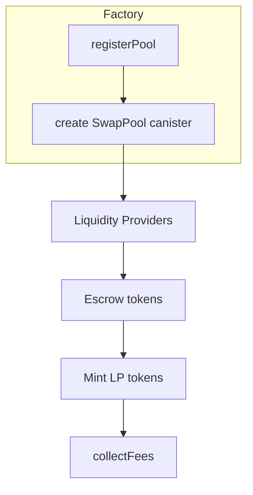

# DEX Canister Interfaces

This document summarises the publicly available Candid interface files and reward related functions for popular Internet Computer DEX platforms. The canister IDs are sourced from each project’s open documentation or GitHub repositories when available. Missing information is noted where we were unable to locate an official specification.

## Matrix

| DEX | LP / Escrow Canister | Candid Source | Reward Claim Method | Notes |
|-----|---------------------|---------------|--------------------|-------|
| **ICPSwap** | `SwapPool` | [icpswap-v3-service](https://github.com/ICPSwap-Labs/icpswap-v3-service) | `claim` | official repo provides Motoko code; candid not published |
| **Sonic** | - | - | - | no public candidate found |
| **InfinitySwap** | - | - | - | no public candidate found |

The repository only contains the aggregator’s Candid (`candid/aggregator.did`) and a placeholder file for other interfaces. No direct DEX canister Candid definitions were found here.

## Pool Registry Layout

From ICPSwap’s `SwapFactory.mo` we infer pools are registered by token pair in a map. Each pool keeps track of liquidity positions and accumulated fees. However the exact Motoko code is extensive and there is no compiled Candid. The following diagram approximates the data flow.

## Underlying Token Math

Without the Candid files we cannot detail the precise numeric operations. In general, DEX pools calculate shares based on token ratios and maintain a ledger of accumulated fees per position.

## Disclaimer

The above information is compiled from publicly accessible GitHub repositories. Maintainers of each DEX are encouraged to review the function list and diagrams for accuracy.
